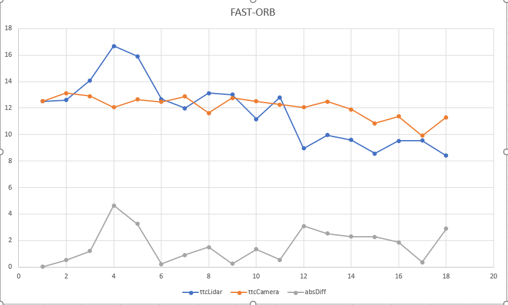

# SFND 3D Object Tracking

Welcome to the final project of the camera course. By completing all the lessons, you now have a solid understanding of keypoint detectors, descriptors, and methods to match them between successive images. Also, you know how to detect objects in an image using the YOLO deep-learning framework. And finally, you know how to associate regions in a camera image with Lidar points in 3D space. Let's take a look at our program schematic to see what we already have accomplished and what's still missing.

In this final project, you will implement the missing parts in the schematic. To do this, you will complete four major tasks: 
1. First, you will develop a way to match 3D objects over time by using keypoint correspondences. 
2. Second, you will compute the TTC based on Lidar measurements. 
3. You will then proceed to do the same using the camera, which requires to first associate keypoint matches to regions of interest and then to compute the TTC based on those matches. 
4. And lastly, you will conduct various tests with the framework. Your goal is to identify the most suitable detector/descriptor combination for TTC estimation and also to search for problems that can lead to faulty measurements by the camera or Lidar sensor. In the last course of this Nanodegree, you will learn about the Kalman filter, which is a great way to combine the two independent TTC measurements into an improved version which is much more reliable than a single sensor alone can be. But before we think about such things, let us focus on your final project in the camera course. 

## Dependencies for Running Locally
* cmake >= 2.8
  * All OSes: [click here for installation instructions](https://cmake.org/install/)
* make >= 4.1 (Linux, Mac), 3.81 (Windows)
  * Linux: make is installed by default on most Linux distros
  * Mac: [install Xcode command line tools to get make](https://developer.apple.com/xcode/features/)
  * Windows: [Click here for installation instructions](http://gnuwin32.sourceforge.net/packages/make.htm)
* Git LFS
  * Weight files are handled using [LFS](https://git-lfs.github.com/)
* OpenCV >= 4.1
  * This must be compiled from source using the `-D OPENCV_ENABLE_NONFREE=ON` cmake flag for testing the SIFT and SURF detectors.
  * The OpenCV 4.1.0 source code can be found [here](https://github.com/opencv/opencv/tree/4.1.0)
* gcc/g++ >= 5.4
  * Linux: gcc / g++ is installed by default on most Linux distros
  * Mac: same deal as make - [install Xcode command line tools](https://developer.apple.com/xcode/features/)
  * Windows: recommend using [MinGW](http://www.mingw.org/)

## Basic Build Instructions

1. Clone this repo.
2. Make a build directory in the top level project directory: `mkdir build && cd build`
3. Compile: `cmake .. && make`
4. Run it: `./3D_object_tracking`.

## Final project report

1. Estimating TTC with lidar is prone to errors because of outliers. But this can be reduced by incorporating some filtering method where instead of chosing the closes point (with respect to x coordinate) from the vehicle eiither mean of all the points or median of the points or 25th percentile etc. is considered for calculation. In the current implementation median is used and it does a good job in reducing the outlier effect. There are no cases found where TTC jumps to a very high value or a very low value discretely.

2. Estimating TTC with camera higly depends on robustness in detecting and matching keypoints. If keypoint detection or matching based on descriptors is off TTC calculations would be drastically off. This can be seen in experiments with HARRIS and ORB detectors where some of the values are NANs and some values are -inf. With other detectors - BRISK, AKAZE, SHITOMASI and SIFT, calculations doesn't appear too erratic but they jump very discretlty between frames (these patterns can be seen the plots below). Among all the descriptors, FAST detector combined with all the descriptors seems to be giving better results - can be seen from relatively smooth plot camerTTC in the plots below.

3. Below is the collection of plots showing lidarTTC, cameraTTC and abs(lidarTTC-cameraTTC) for different detector-descriptor pairs over the sequence of images from test data
| | | | | | |
|:-------------:|:-------------:|:-------------:|:-------------:|:-------------:|:-------------:|
| AKAZE-AKAZE| AKAZE-BRIEF| AKAZE-BRISK| AKAZE-FREAK| AKAZE-ORB| AKAZE-SIFT|
| | BRISK-BRIEF| BRISK-BRISK| BRISK-FREAK| BRISK-ORB| BRISK-SIFT|
| | FAST-BRIEF| FAST-BRISK| FAST-FREAK| FAST-ORB| FAST-SIFT|
| | HARRIS-BRIEF| HARRIS-BRISK| | HARRIS-ORB| HARRIS-SIFT|
| | ORB-BRIEF| ORB-BRISK| ORB-FREAK| ORB-ORB| ORB-SIFT|
| | SHITOMASI-BRIEF| SHITOMASI-BRISK| SHITOMASI-FREAK|| SHITOMASI-SIFT|
| | SIFT-BRIEF| SIFT-BRISK| SIFT-FREAK| | SIFT-SIFT|

**Conclusion:** TTC from lidar measurements can be erratic due to outliers but aplying filtering techniques on them would provide better results. While calculatin TTC from camera alone, choise of detector and descriptor is very important. From above experiments FAST-BRIEF pair can be recommended based on relative smooth TTC plot over the multiple frames. 